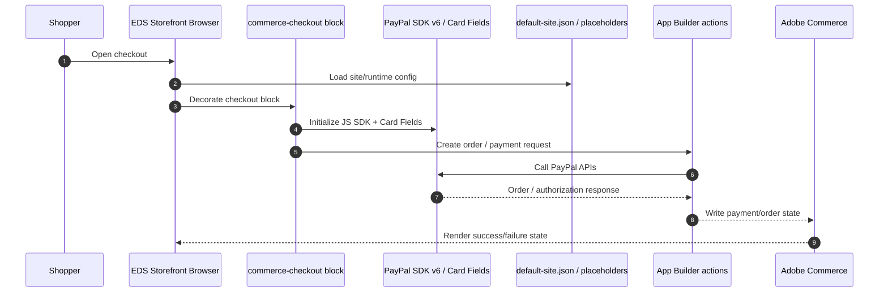

# Project Handoff: Adobe Commerce EDS + PayPal Integration

## What this project is
This is an **Edge Delivery Services (EDS) storefront** for Adobe Commerce, extended with PayPal checkout work. The repo is based on the Adobe Commerce boilerplate for EDS and contains storefront blocks, drop-in integrations, scripts, styles, placeholder labels, and site config.

The current work in this branch is focused on a **direct PayPal integration** using the PayPal JavaScript SDK v6 core and Card Fields, plus supporting checkout/config plumbing for an Adobe Commerce storefront.

## High-level architecture

```mermaid
flowchart LR
  Shopper[Shopper Browser] --> EDS[EDS Storefront]
  EDS --> CheckoutBlock[commerce-checkout block]
  CheckoutBlock --> PayPalSDK[PayPal JS SDK v6 core]
  CheckoutBlock --> Dropins[@dropins/storefront-checkout]
  CheckoutBlock --> CommerceConfig[Commerce config / placeholders]
  EDS --> CommerceScripts[scripts/commerce.js + scripts/scripts.js]
  CommerceScripts --> DefaultSite[default-site.json]
  CheckoutBlock --> AppBuilder[App Builder actions / setup scripts]
  AppBuilder --> PayPalAPI[PayPal APIs]
  AppBuilder --> CommerceBackend[Adobe Commerce / SaaS]
```

## Repository shape
Key areas in the repo:
- `blocks/` — storefront blocks and block-specific CSS/JS
- `scripts/` — shared runtime helpers, commerce glue, setup scripts
- `placeholders/` — localized/user-facing label overrides
- `styles/` — global tokens and styles
- `default-site.json` — runtime Commerce and PayPal config
- `Paypal-Integration-docs/` — design/reference material for the payment work

## What has been implemented so far

### 1) Checkout / PayPal integration work
There is a custom checkout path under `blocks/commerce-checkout/` that now includes a dedicated checkout entrypoint and supporting container logic.

Observed PayPal-related implementation signals in the repo include:
- `scripts/setup/register-paypal-oope-method.js` — setup script for registering a PayPal out-of-process payment method
- `initializers/paypal.js` — reads PayPal config and initializes the PayPal SDK
- `scripts/paypal-sdk.js` / `scripts/paypal-api.js` — PayPal SDK/API helpers
- `default-site.json` — contains PayPal runtime config keys:
  - `paypal-client-id`
  - `paypal-sdk-components`
  - `paypal-intent`
  - `paypal-currency`

### 2) Config-driven startup
The storefront bootstraps Commerce/PayPal behavior from site config and placeholders rather than hardcoding credentials.
Important runtime config currently visible in `default-site.json`:
- `paypal-client-id` is sourced from `$PAYPAL_CLIENT_ID`
- `paypal-sdk-components` defaults to `buttons,card-fields`
- `paypal-intent` currently appears set to `capture`
- `paypal-currency` currently appears set to `USD`

### 3) Repository-level checkout/payment dependencies
From `package.json`, the project includes:
- `@dropins/storefront-checkout`
- `@dropins/storefront-payment-services`
- `@dropins/storefront-cart`
- `@dropins/storefront-order`
- `@dropins/storefront-auth`
- `@dropins/storefront-account`
- `@dropins/storefront-pdp`
- `@dropins/tools`

That means this codebase is built around Adobe drop-ins + EDS, with PayPal being wired into the storefront checkout experience.

## Current implementation status
### Working toward
- Direct PayPal checkout integration
- PayPal Buttons + Card Fields support
- Checkout bootstrapping via shared config and startup helpers
- A setup script for registering an OOPE payment method

### Still needs stabilization
- The storefront startup path is currently failing in the browser with config/bootstrap errors:
  - `Failed to fetch config`
  - `Cannot read properties of null (reading 'dataset')`
  - `Error getting 418 page`
- Validation in this session also showed environment issues when trying to run the full build/lint pipeline from the current root

## Flow diagram: checkout path



## Key files to inspect next
If another coding agent continues this work, start with:
- `blocks/commerce-checkout/commerce-checkout.js`
- `blocks/commerce-checkout/containers.js`
- `scripts/paypal-sdk.js`
- `scripts/paypal-api.js`
- `scripts/setup/register-paypal-oope-method.js`
- `initializers/paypal.js`
- `default-site.json`

## Notes for the next agent
- This repo is an **AEM Edge Delivery Services storefront**, not an App Builder-only project.
- PayPal work is tightly coupled to checkout startup/config loading.
- The current browser failure strongly suggests a startup/config fallback bug, not just a checkout UI issue.
- Keep the EDS conventions intact: block JS/CSS, `default-site.json`, placeholders, and shared scripts.

## Suggested next debugging direction
1. Inspect the startup path in `scripts/commerce.js` and `scripts/scripts.js`.
2. Verify what the runtime expects from `default-site.json` and session config.
3. Guard the error-page fallback so a missing 418 page does not crash the whole app.
4. Confirm the checkout block only mounts after configuration is ready.

## Short summary
This repository is an EDS storefront for Adobe Commerce, currently being extended with a direct PayPal checkout integration. The important payment-related pieces are already present in config and scripts, but the storefront startup path is unstable and needs a focused fix in the core commerce bootstrap before the site can be considered healthy.
