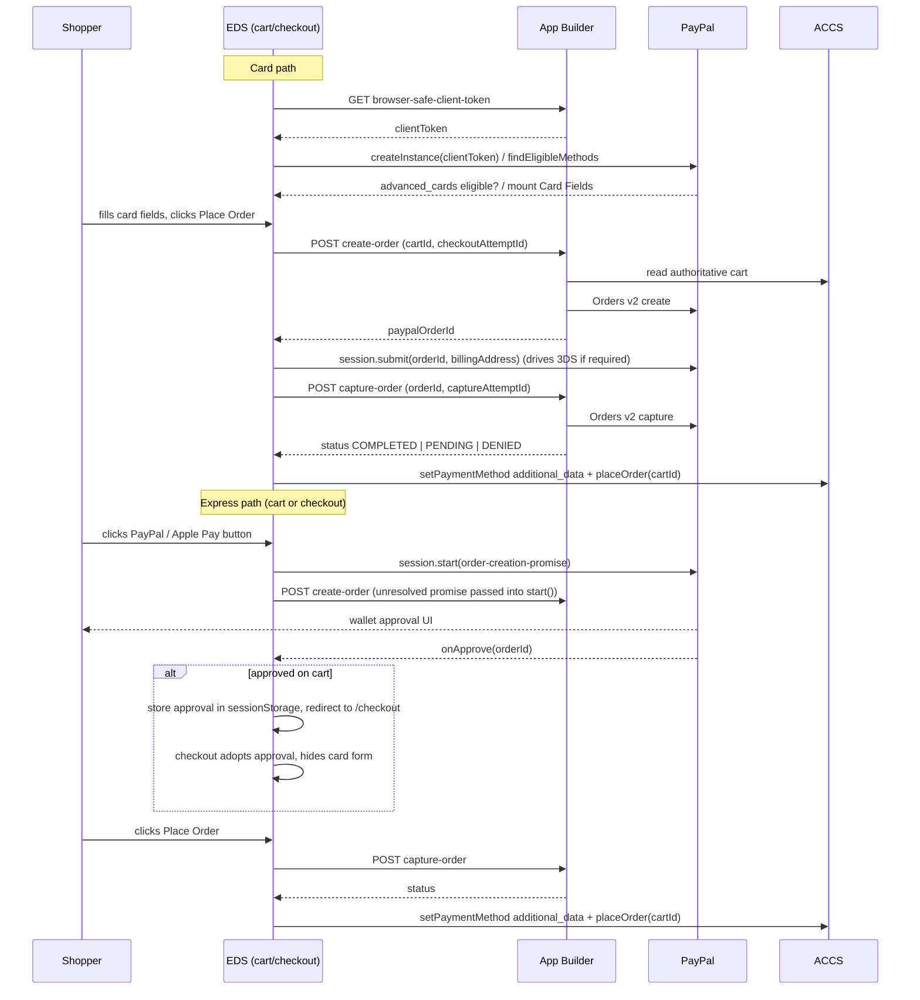

# PayPal Integration — Deployment Guide

Scope: **EDS storefront only**. Covers what was implemented, what config to provide, what App Builder must expose, what ACCS must have configured, and how to test the full flow.

---

## 1. EDS Changes and Configuration

### 1.1 Summary of implementation

PayPal is offered on two surfaces, both routed through App Builder — the browser never talks to PayPal's REST API directly and never sees a client secret.

| Surface | File | What it does |
|---|---|---|
| Card payment method | [blocks/commerce-checkout/paypal-card-fields.js](../blocks/commerce-checkout/paypal-card-fields.js) | Renders PayPal-hosted Card Fields (name/number/expiry/cvv) inside the checkout `PaymentMethods` slot. On Place Order: create order → `session.submit()` (drives 3DS) → capture → attach `paypal_order_id`/`paypal_capture_id` to the Commerce order. |
| Express wallets (PayPal, Apple Pay) | [scripts/paypal-express.js](../scripts/paypal-express.js) | Renders eligible wallet buttons on the **cart** (`.cart__express-checkout`) and **checkout** (`.checkout__express`) pages. Only obtains a buyer-approved PayPal order; capture and order placement always happen on checkout. |
| SDK wrapper | [scripts/paypal-sdk.js](../scripts/paypal-sdk.js) | Loads PayPal JS SDK **v6 core**, creates one shared SDK instance per page from a browser-safe client token, resolves eligibility (`findEligibleMethods`), exposes Card Fields and express session factories. |
| App Builder client | [scripts/paypal-api.js](../scripts/paypal-api.js) | Typed client for the 4 App Builder actions (token, create, capture, get-order). Bounded retries, stable idempotency keys reused across retries, typed `PayPalApiError`. |
| Cart hand-off | `PAYPAL_EXPRESS_APPROVAL_KEY` in `scripts/paypal-express.js` | If a wallet is approved on the cart page, the order id is stored in `sessionStorage` and consumed by the checkout payment method on load — capture never happens on the cart page. |
| Setup script | [scripts/setup/register-paypal-oope-method.js](../scripts/setup/register-paypal-oope-method.js) | One-time operational script to register the PayPal OOPE payment method in ACCS. Excluded from the published site via `.hlxignore`. |

State machine handled by the card-fields controller: `LOADING → READY → CREATING_ORDER → SUBMITTING_CARD → CAPTURING → COMPLETED | CAPTURE_PENDING | CANCELED | FAILED | RECONCILIATION_REQUIRED`. A capture-request error triggers a `get-order` reconciliation call before any failure is shown, so a lost response never causes a duplicate charge.

### 1.2 EDS configuration values

All keys live under `public.default` in the site configuration (the same object `default-site.json` seeds).

| Key | Used by | Purpose | Expected value |
|---|---|---|---|
| `paypal-app-builder-endpoint` | `getPayPalEndpoint()` in `paypal-api.js` | Base URL for the 4 App Builder actions | Full HTTPS base URL, **no trailing slash needed** (trimmed automatically), e.g. `https://<namespace>.adobeioruntime.net/api/v1/web/paypal-connector` |
| `paypal-environment` | `getPayPalEnvironment()` in `paypal-sdk.js` | Selects the PayPal JS SDK v6 script URL | `sandbox` or `production`. Anything else (including an unresolved placeholder) **falls back to `sandbox`** — safe by default, never falls back to production |
| `paypal-payment-method-code` | `getPayPalPaymentMethodCode()` in `paypal-api.js` | Commerce payment method code used for `checkoutApi`/`orderApi` and to key the `PaymentMethods` slot | Must exactly match the code registered in ACCS. Defaults to `paypal_oope` if unset |
| `paypal-express-methods` | `getConfiguredExpressMethods()` in `paypal-sdk.js` | Which wallets to attempt to render | Comma-separated subset of `paypal,apple_pay,google_pay`. Each is still filtered by live PayPal eligibility |
| `paypal-express-cart` | `isExpressEnabled('cart')` | Feature flag for the cart page | `"true"` / `"false"` (string) |
| `paypal-express-checkout` | `isExpressEnabled('checkout')` | Feature flag for the checkout page | `"true"` / `"false"` (string) |

> **Deployment gotcha:** `isPayPalConfigured()` only checks that `paypal-app-builder-endpoint` is a **non-empty string** — it does not detect an unresolved `{PLACEHOLDER}` token. If you deploy with the literal placeholder still in the config, the PayPal payment method **will render and then fail** (shows "PayPal payment options are temporarily unavailable") instead of disappearing cleanly, and express buttons will disappear (their failure path removes the container) after one failed eligibility check. Replace the placeholder with a real endpoint, or delete the key entirely, before pushing to any environment where you don't want PayPal visible.

No changes were required to `head.html` / CSP — the existing policy (`script-src … https:`, `frame-src 'self' https:`, no `default-src`) already permits PayPal's script and iframe origins.

---

## 2. App Builder Dependencies and Configuration

### 2.1 Endpoint

Provide one base URL per environment for `paypal-app-builder-endpoint`. EDS appends the action path with a single `/`, e.g. `{base}/create-order`.

### 2.2 Required actions and contracts

These are the **exact** contracts the EDS client in `scripts/paypal-api.js` calls. All are relative to the configured base URL.

#### `GET /browser-safe-client-token`
- Request: no body. Headers include `X-Request-Id` (random per call, not idempotency-sensitive).
- Response `200`:
  ```json
  { "clientToken": "string" }
  ```
- EDS throws if `clientToken` is missing or empty.
- **Must never return the PayPal client secret.**

#### `POST /create-order`
- Request body:
  ```json
  { "cartId": "string", "checkoutAttemptId": "string" }
  ```
- Request header: `X-Request-Id: paypal-create-{checkoutAttemptId}` — **stable across retries of the same checkout attempt**. Treat as the idempotency key (map to PayPal's `PayPal-Request-Id`).
- Response `200`:
  ```json
  { "paypalOrderId": "string", "status": "CREATED" }
  ```
- Server responsibilities: read the authoritative ACCS cart, derive amount/currency/line items server-side, create the PayPal Orders v2 order. The browser only supplies `cartId`.

#### `POST /capture-order`
- Request body:
  ```json
  { "cartId": "string", "paypalOrderId": "string", "captureAttemptId": "string" }
  ```
- Request header: `X-Request-Id: paypal-capture-{paypalOrderId}-{captureAttemptId}` — stable across retries of this specific capture attempt.
- Response `200`:
  ```json
  { "paypalOrderId": "string", "captureId": "string", "status": "COMPLETED" }
  ```
  `status` must be one of `COMPLETED | PENDING | DENIED` (anything else is treated by EDS as "needs reconciliation").
  - `COMPLETED` → EDS attaches `paypal_order_id` / `paypal_capture_id` to the Commerce order and calls `orderApi.placeOrder`.
  - `PENDING` → EDS shows a "do not retry" message and does **not** place the order.
  - `DENIED` → EDS shows a decline message and starts a fresh order on the next attempt.

#### `POST /get-order`
- Request body:
  ```json
  { "cartId": "string", "paypalOrderId": "string" }
  ```
- Response: same shape as capture-order.
- Used only for reconciliation when a capture-order call throws (timeout/5xx) — EDS asks for the authoritative state instead of retrying capture blindly, so a lost response can never cause a duplicate charge.

### 2.3 Error contract (all actions)

Non-2xx responses should return JSON so EDS can surface a useful message:
```json
{ "message": "string", "code": "string", "details": {} }
```
EDS retries `502/503/504` automatically (bounded, exponential backoff, same idempotency key); all other non-2xx statuses are surfaced immediately as failures.

### 2.4 Other App Builder requirements

- **CORS**: allow the storefront origins — local dev (`http://localhost:3000`), preview (`*.aem.page`), live (`*.aem.live`), and the production domain.
- **Idempotency**: honour `X-Request-Id` as the PayPal `PayPal-Request-Id` for create/capture so replayed requests never create a second order or double-charge.
- **Credentials boundary**: client id/secret and any privileged OAuth token stay in App Builder; only the browser-safe client token crosses to EDS.
- **Webhook handling**: App Builder should independently subscribe to `PAYMENT.CAPTURE.COMPLETED` / `PAYMENT.CAPTURE.DENIED` (etc.) for reconciliation in case the buyer's browser never returns — this is outside EDS's reach but affects whether `get-order` reflects the true final state.
- **Shipping address on express checkout**: confirm whether App Builder writes PayPal's returned shipping address back to the ACCS cart on express approval. If not, the buyer will re-enter address details on the checkout page after an express wallet approval from the cart.

---

## 3. ACCS Configuration

1. **Register the PayPal OOPE (out-of-process) payment method** so it appears in the Commerce payment method list and `code` matches `paypal-payment-method-code` in EDS config (default `paypal_oope`).
   Run once per environment:
   ```bash
   COMMERCE_BASE_URL=... \
   COMMERCE_ADMIN_TOKEN=... \
   PAYPAL_APP_BUILDER_ENDPOINT=... \
   node scripts/setup/register-paypal-oope-method.js
   ```
   This posts to `{COMMERCE_BASE_URL}/V1/oope_payment_method`. Admin token and Commerce URL must never be committed — supply them as environment variables at run time only.
2. **Confirm the method's `backend_integration_url`** points at the same App Builder endpoint used above, so Commerce and App Builder agree on which integration owns the payment method.
3. **No other Commerce-side change** is required by the EDS code — cart/checkout otherwise use the existing `@dropins/storefront-checkout` / `@dropins/storefront-cart` GraphQL flows unchanged. `orderApi.placeOrder(cartId)` is called exactly as it is for every other payment method, after the PayPal-specific additional data has been attached via the standard payment method flow.

---

## 4. Working Flow and Testing

### 4.1 End-to-end flow



### 4.2 Pre-test checklist

- [ ] `paypal-app-builder-endpoint` set to a real sandbox App Builder URL (not the placeholder)
- [ ] `paypal-environment` = `sandbox`
- [ ] `paypal-payment-method-code` matches the ACCS OOPE registration
- [ ] OOPE method registered in the ACCS sandbox instance
- [ ] Sandbox PayPal buyer account + test cards (including a 3DS-required test card) available
- [ ] App Builder CORS allows `http://localhost:3000` (or your preview domain)

### 4.3 Test steps

**A. Regular card checkout — success**
1. Add an item to cart, go to checkout, select the PayPal payment method.
2. Confirm the four hosted card fields render (name/number/expiry/cvv) with no console errors.
3. Enter a sandbox test card, click Place Order.
4. Expect: `SUBMITTING_CARD` → `CAPTURING` → order placed, redirected to the confirmation page.
5. Verify in ACCS that the order was created with `paypal_order_id` / `paypal_capture_id` on the payment record.

**B. Regular card checkout — 3DS challenge**
1. Use a sandbox card that forces a 3DS challenge.
2. Confirm the challenge UI appears during `session.submit()` and completing it proceeds to capture.

**C. Regular card checkout — decline**
1. Use a sandbox decline test card.
2. Expect a decline message, order not placed, and the next Place Order attempt creates a **new** PayPal order (previous one is discarded, per `PAYPAL_STATUS.DENIED` handling).

**D. Cancellation**
1. Start card submission, then trigger a PayPal-side cancel (or close the 3DS challenge if your sandbox supports it).
2. Expect a "canceled" message and the ability to retry without a page reload.

**E. Express checkout — cart**
1. On the cart page with items added, confirm the PayPal/Apple Pay buttons render under order summary (only if eligible).
2. Click PayPal, approve the sandbox order in the popup.
3. Expect redirect to `/checkout`, the PayPal payment method mounted with the card grid **hidden** and an "approved with PayPal" message, and Place Order completing without re-entering card details.

**F. Express checkout — on checkout page directly**
1. From checkout (not via cart hand-off), click the PayPal express button above the form.
2. Approve in the popup, confirm the same "approved" state appears, then Place Order captures and completes.

**G. Feature flags**
1. Set `paypal-express-cart` to `false`, confirm the express region disappears from the cart with no console errors.
2. Set `paypal-express-checkout` to `false`, confirm the same on checkout, while the card payment method still works.

**H. Misconfiguration**
1. Temporarily point `paypal-app-builder-endpoint` at an invalid/unreachable URL.
2. Confirm: express buttons disappear cleanly; the card payment method shows the "temporarily unavailable" message but the rest of checkout (other payment methods, place order for them) remains functional.

**I. Reconciliation**
1. If your sandbox/App Builder supports simulating a capture timeout or 5xx, trigger it and confirm EDS calls `get-order` and reflects the reconciled status instead of retrying capture blindly.
